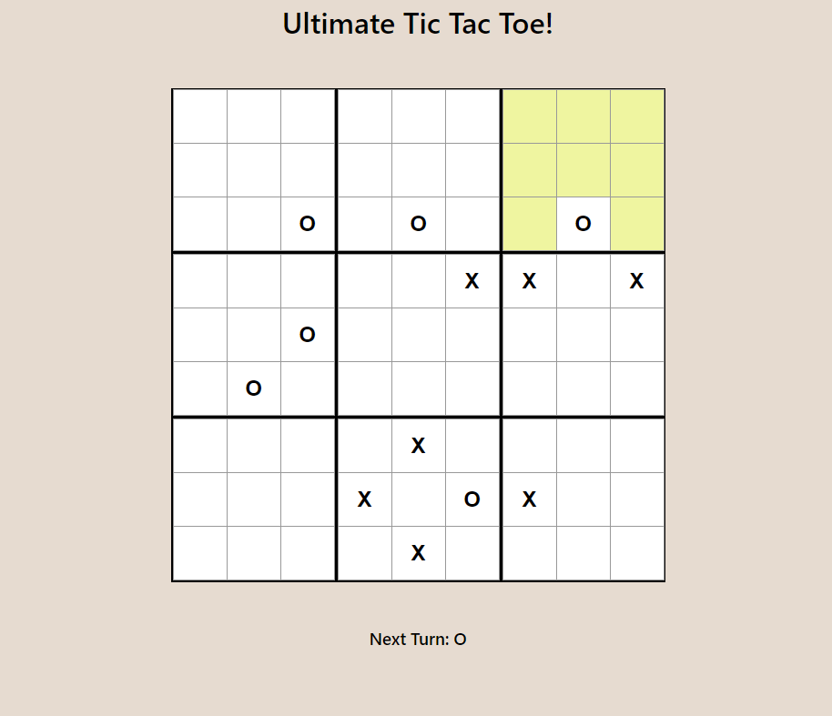

# Ultimate Tic Tac Toe

9 x 9 version of tic tac toe, where your opponent's move determines your next move. 

## Screenshots

## Tech Stack

I used React and CSS

## Installation

Download or clone the repository, then run npm install
## Roadmap

- Add multiplayer version using Socket.IO in the backend
 
- Add computer for single player games

## License

[MIT](https://choosealicense.com/licenses/mit/)

